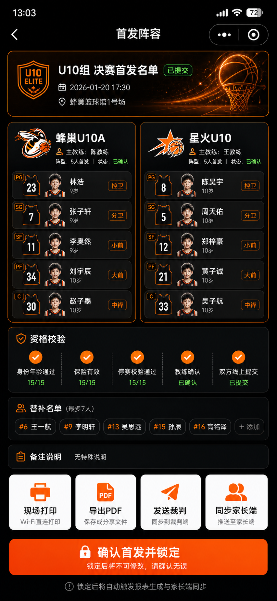
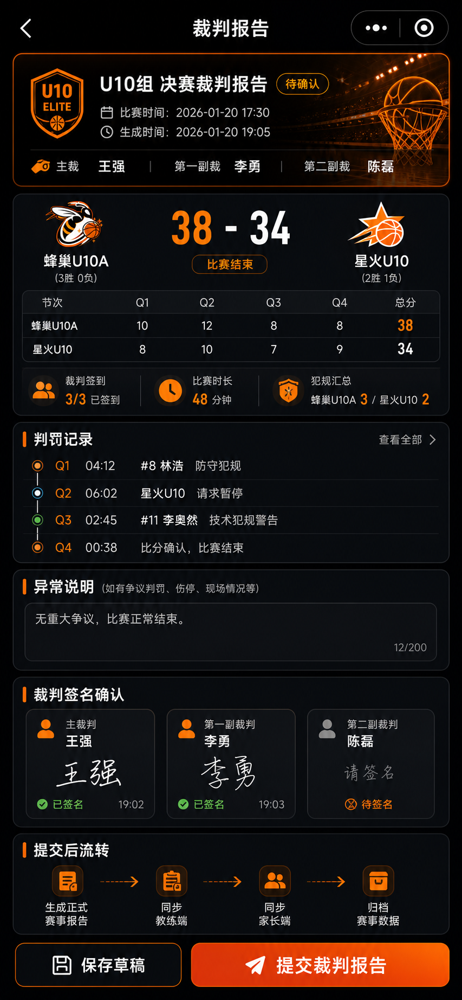
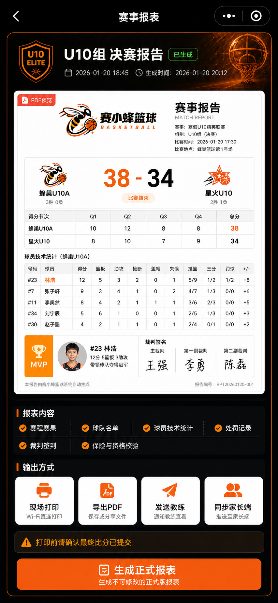
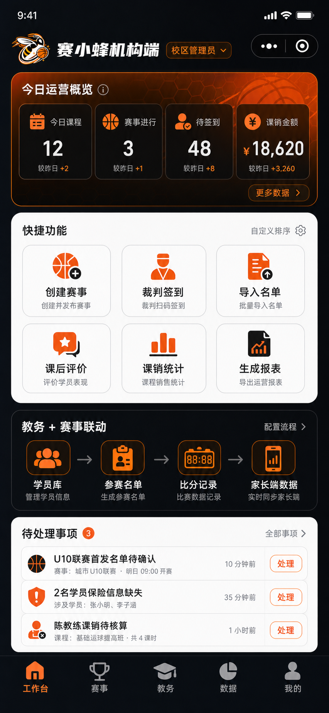
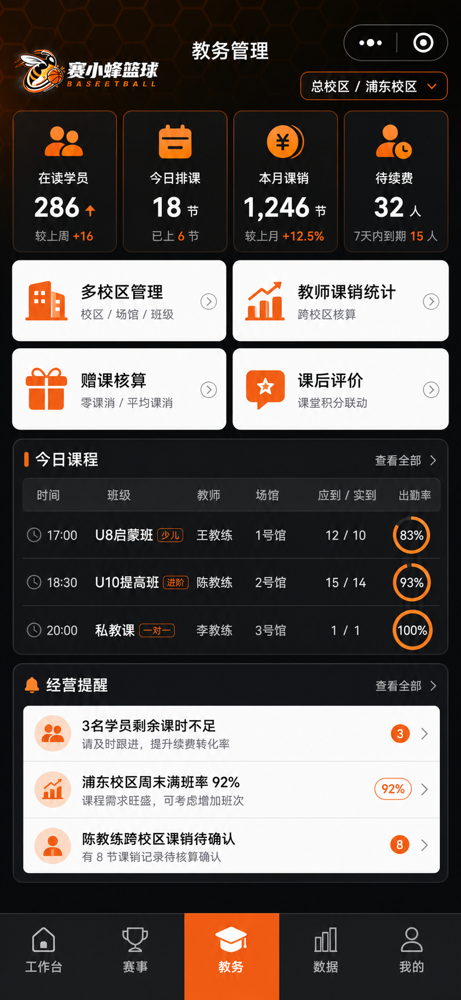
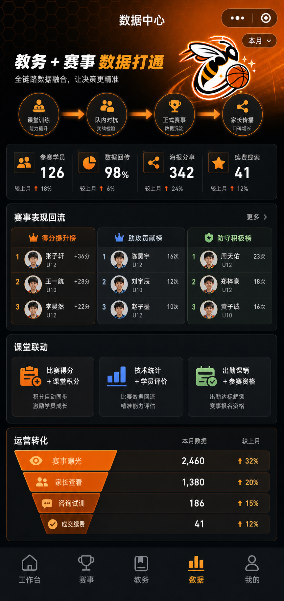
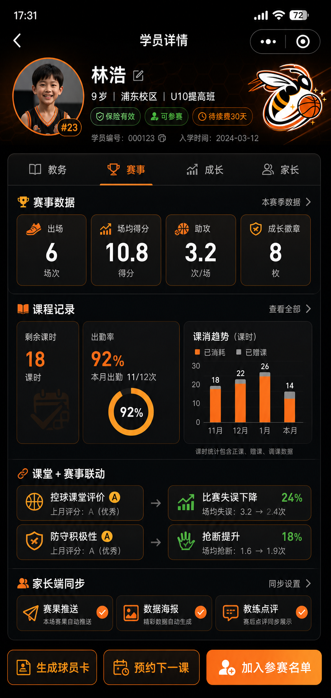

# 赛小蜂篮球 2.0 原型实现说明书

> 面向对象：产品、UI、前端、小程序开发、后台开发。  
> 文档性质：开发实现参考，不是给客户阅读的使用手册。  
> 目标：说明每张原型图的页面结构、组件构成、数据来源、交互状态、页面层级和实现原理，方便后续按图还原。

## 1. 产品定位

赛小蜂篮球 2.0 是面向篮球教培机构的「教务 + 赛事数据打通」小程序系统。

核心不是单纯卖课页面，而是把机构的学员库、教练、课消、赛事、裁判计分、家长传播数据打通，形成一套机构内部可管理、现场可执行、家长端可传播的闭环。

## 2. 页面层级总览

### 2.1 一级页面

一级页面是底部 Tab 或核心入口级页面：

- 首页 / 机构工作台
- 赛事
- 学员
- 教务
- 我的

### 2.2 二级页面

二级页面承接具体业务流程：

- 创建赛事
- 赛事详情
- 裁判比分板
- PAD 横屏比分板
- 教练记录端
- 学员库导入名单
- 首发阵容名单报告
- 资格自动校验
- 赛事报表
- 赛后裁判报告
- 教务管理
- 薪酬销售核算
- 学员详情数据中台
- 家长传播资产管理
- 多角色入口
- 高阶定制服务

### 2.3 三级页面

三级页面一般是弹窗、抽屉、明细或配置页：

- 选择球员弹窗
- 编辑首发弹窗
- 犯规 / 技术统计选择弹窗
- MC 音效选择弹窗
- 裁判扫码签到弹窗
- 报表导出 / 打印确认弹窗
- 球员海报预览页
- 徽章 / 皮肤选择页
- 课消明细页
- 教练工资明细页

## 3. 统一视觉与组件规则

### 3.1 视觉基调

- 主色：篮球橙 `#ff5a12`、金橙 `#ffb21a`
- 背景：深黑、暗灰、篮球场馆光效、蜂窝纹理
- 强调：白色大字、橙色描边、玻璃拟态黑色卡片
- 用途：赛事、计分、报表页面使用强运动风；教务、工资、数据页面适当降低视觉噪音，提高可读性

### 3.2 通用页面骨架

小程序竖屏页面建议统一为：

- 顶部导航栏：返回按钮、页面标题、微信胶囊占位
- 背景层：暗色渐变 + 蜂窝纹理 + 篮球光效
- 内容层：卡片容器、数据模块、操作按钮
- 底部操作区：主 CTA 或 TabBar

### 3.3 通用组件清单

- `PageShell`：页面外壳，控制安全区、背景、滚动区域
- `NavBar`：自定义导航栏
- `HeroPanel`：顶部品牌 / 赛事 / 页面核心信息卡
- `MetricCard`：关键数据卡，如学员数、课消、赛事数、收入
- `ActionCard`：功能入口卡，如创建赛事、导入名单、生成报表
- `DataTable`：统计表格，如比分节次、球员技术统计、课消明细
- `StatusTag`：状态标签，如已生成、待校验、已签到、未提交
- `PrimaryButton`：橙色主按钮
- `SecondaryButton`：白色或深色次按钮
- `RoleSwitch`：角色切换入口
- `ReportPreview`：报表预览容器
- `ScoreDisplay`：比分数字组件
- `TimerControl`：比赛计时组件
- `MCPanel`：现场音乐 / 主持音效控制组件

## 4. 页面原型实现说明

### 4.1 登录页

页面目标：完成微信登录、游客体验、协议勾选，并建立篮球品牌第一印象。

结构：

- 背景层：篮球馆光效、蜂窝纹理、橙黑渐变
- 品牌区：赛小蜂篮球 Logo、中文品牌名、英文 `BASKETBALL`
- 登录卡片：微信一键登录、游客体验、协议勾选

组件：

- `LoginHero`
- `LogoBlock`
- `LoginPanel`
- `AgreementCheck`

实现要点：

- 微信登录按钮必须绑定授权流程
- 游客体验只进入演示数据，不写入正式机构数据
- 协议勾选状态需要在按钮点击前校验

### 4.2 机构工作台

页面目标：作为机构管理端首页，集中展示教务、赛事、课消、数据概览。

结构：

- 顶部机构信息卡：机构名称、校区、当前账号角色
- 数据概览：今日课程、待办赛事、课消金额、报名线索
- 快捷入口：创建赛事、学员库、教务管理、赛事报表
- 待办列表：资格待校验、首发待提交、裁判待签到、报表待生成

组件：

- `OrgHeaderCard`
- `DashboardMetricGrid`
- `QuickActionGrid`
- `TodoList`

数据来源：

- 机构表
- 校区表
- 学员表
- 课程 / 课消表
- 赛事表
- 报表生成状态

### 4.3 多角色入口

页面目标：区分裁判端、教练记录端、家长端、游客端。

结构：

- 当前赛事信息卡
- 四个角色入口卡
- 权限说明 / 状态提示

角色规则：

- 裁判端：可计分、记犯规、签到、结束比赛、生成赛果
- 教练记录端：可提交名单、记录队内表现、查看本队数据
- 家长端：只看自家孩子数据、海报、成长档案
- 游客端：只看公开比分和赛程

实现要点：

- 角色权限不要只靠前端隐藏，后端接口也要校验
- 同一用户可能拥有多角色，需要支持角色切换

### 4.4 创建赛事

页面目标：创建一场可执行的比赛。

结构：

- 基础信息：赛事名称、组别、时间、地点、场地
- 队伍设置：主队、客队、队标、颜色
- 赛制设置：节数、每节时长、暂停次数、是否启用技术统计
- 角色设置：裁判、记录员、教练

组件：

- `FormSection`
- `TeamSetupCard`
- `RuleConfigPanel`
- `RoleAssignPanel`

数据产物：

- `match`
- `matchTeams`
- `matchRules`
- `matchRoles`

### 4.5 学员库导入参赛名单

页面目标：教练从内部学员库直接导入参赛名单，避免家长重复填报。

结构：

- 顶部赛事 / 队伍信息
- 学员筛选：校区、班级、年龄段、教练
- 学员列表：头像、姓名、号码、年龄、保险、状态
- 已选名单栏

组件：

- `StudentFilterBar`
- `StudentSelectableList`
- `SelectedRosterBar`

实现要点：

- 选择名单后生成 `matchRoster`
- 号码重复、年龄不符、保险缺失要即时提示
- 支持批量导入和单个调整

### 4.6 参赛资格自动校验

页面目标：赛前自动检查身份、年龄、保险、停赛状态。

结构：

- 校验总览卡：通过人数、异常人数、待补充人数
- 校验项列表：身份、年龄、保险、停赛
- 异常处理入口：补资料、移除名单、人工通过

组件：

- `VerificationSummary`
- `VerificationItem`
- `ExceptionActionSheet`

运行原理：

- 学员库提供基础身份数据
- 赛事规则提供年龄 / 组别限制
- 保险字段判断是否有效
- 处罚记录判断是否停赛

### 4.7 首发阵容名单报告

页面目标：双方线上提交首发名单，并生成赛前可打印 / 可归档的名单报告。

结构：

- 顶部赛事信息：赛事、组别、时间、场地
- 主队首发：5 名首发、替补名单、教练签名状态
- 客队首发：5 名首发、替补名单、教练签名状态
- 校验状态：年龄、保险、停赛、号码冲突
- 输出操作：导出 PDF、现场打印、提交裁判

组件：

- `StartingLineupReport`
- `RosterTable`
- `CoachSignatureBlock`
- `EligibilityStatusRow`

实现要点：

- 首发名单提交后应锁定，修改需留下操作记录
- 报告要带赛事编号、生成时间、提交人
- 裁判端开赛前必须能看到双方首发是否已提交

### 4.8 裁判比分板

页面目标：手机竖屏下完成现场计分、计时、犯规、技术统计、裁判签到、赛果生成。

结构：

- 顶部状态：LIVE、第几节、剩余时间、设置入口
- 比分主面板：主队、客队、比分、累计犯规、节次切换
- 计时控制：开始 / 暂停、重置
- 双队操作区：+1、+2、+3、犯规、暂停
- 技术统计：得分、篮板、助攻、抢断、盖帽、失误
- 裁判签到：主裁判、第一副裁判、第二副裁判
- 底部操作：提交本节、结束比赛、生成赛果

组件：

- `ScoreboardHeader`
- `TeamScorePanel`
- `PeriodSwitcher`
- `GameClock`
- `TeamActionPad`
- `TechnicalStatGrid`
- `RefereeCheckinPanel`
- `MatchEndActionBar`

实现要点：

- 所有计分操作必须写入操作流水，支持撤销
- 比分数字要使用大字号、七段数码风格
- 比赛结束前确认最终比分，避免误生成正式赛果

### 4.9 裁判比分板 + MC 功能

页面目标：把原有 MC 音乐 / 现场音效能力并入计分板，方便现场一屏控制。

新增结构：

- MC 控制面板
- 当前播放状态
- 音量滑杆
- 音效分类：进攻、防守、得分、暂停、换人、MVP、开场、结束
- 快捷播报：主队得分、客队得分、犯规提示、暂停提示

组件：

- `MCPanel`
- `AudioCategoryTabs`
- `AudioButtonGrid`
- `VolumeSlider`
- `NowPlayingBar`

实现原理：

- 后台维护音频库
- 小程序拉取可用音频列表
- 本地播放时记录播放状态
- 比分事件可以触发推荐音效，但是否自动播放需要配置开关

### 4.10 PAD 横屏比分板

页面目标：适配平板横屏，给现场裁判 / 记录台提供更宽、更高效的操作界面。

结构：

- 横向顶部栏：赛事名、LIVE、节次、计时、网络状态、设置
- 左侧主队操作区：队标、队名、比分、犯规、暂停、加分按钮
- 中央计时区：大计时器、开始暂停、重置、节次切换
- 右侧客队操作区：结构同主队
- 底部统计区：技术统计、球员选择、最近操作
- 右侧或底部 MC 面板：音效、音量、当前播放

组件：

- `PadScoreboardLayout`
- `WideTeamPanel`
- `CenterClockPanel`
- `PadActionDock`
- `RecentEventTimeline`
- `PadMCPanel`

适配规则：

- 横屏优先使用三栏布局
- 按钮尺寸要适合手指快速点击
- 分数、时间、节次是视觉中心
- MC 面板不能遮挡计分核心操作

### 4.11 教练记录端

页面目标：教练记录本队表现，并与课堂积分、家长端成长数据联动。

结构：

- 队伍信息卡
- 球员列表
- 快速记录：表现、态度、进步点、课堂积分
- 数据回传状态

组件：

- `CoachTeamHeader`
- `PlayerPerformanceList`
- `QuickRatingPanel`
- `SyncStatusTag`

实现要点：

- 教练只能编辑自己负责队伍 / 班级的数据
- 赛后表现数据回写到学员成长档案

### 4.12 游客端比分直播

页面目标：对外展示公开赛事比分，不暴露机构内部数据。

结构：

- 比赛基础信息
- 实时比分
- 节次比分
- 简化技术统计

组件：

- `PublicScoreHeader`
- `LiveScoreCard`
- `QuarterScoreTable`

权限规则：

- 游客不可见手机号、身份证、保险、内部评价、课消数据

### 4.13 家长端赛事数据

页面目标：让家长看到孩子的赛事表现，并推动分享传播。

结构：

- 孩子信息卡
- 单场数据：得分、篮板、助攻、抢断等
- 阶段成长：近 5 场趋势
- 分享入口：生成海报、球员卡、徽章

组件：

- `ChildProfileCard`
- `MatchStatsCard`
- `TrendChartCard`
- `ShareAssetEntry`

数据来源：

- 裁判比分板
- 教练记录端
- 球员技术统计表

### 4.14 家长传播资产管理

页面目标：自动生成球员数据海报、球员卡、徽章成长体系。

结构：

- 海报模板列表
- 球员卡预览
- 徽章墙
- 赛照上传 / 自动抠图入口

组件：

- `PosterTemplateGrid`
- `PlayerCardPreview`
- `BadgeWall`
- `PhotoCutoutUploader`

实现要点：

- 模板底板可配置
- 数据字段从比赛统计自动填充
- 图片生成建议服务端完成，前端只负责预览和保存

### 4.15 赛事报表

页面目标：生成专业赛事 PDF 报表，支持打印、导出、同步家长端。

结构：

- 顶部赛事状态卡
- PDF 预览区
- 报表内容检查项
- 输出方式：现场打印、导出 PDF、发送教练、同步家长端
- 最终生成按钮

组件：

- `ReportHeaderCard`
- `PDFPreviewCard`
- `ReportChecklist`
- `ReportOutputGrid`
- `GenerateReportButton`

报表内容：

- 赛程赛果
- 球队名单
- 球员技术统计
- 处罚记录
- 裁判签到
- 保险与资格校验

### 4.16 赛后裁判报告

页面目标：记录裁判对比赛过程、争议、处罚、签名、异常事件的正式说明。

结构：

- 比赛基础信息
- 裁判签到信息
- 犯规 / 处罚汇总
- 争议事件记录
- 设备 / 现场异常记录
- 裁判签字区
- 提交正式报告按钮

组件：

- `RefereeReportHeader`
- `PenaltySummaryTable`
- `IncidentTimeline`
- `RefereeSignatureBlock`

实现要点：

- 赛后裁判报告生成后应进入不可随意修改状态
- 修改需记录版本和操作人
- 报告要和赛事报表关联

### 4.17 教务管理

页面目标：管理多校区、课程、排课、学员、课消。

结构：

- 校区切换
- 今日课程
- 学员出勤
- 课消统计
- 赠送课时核算

组件：

- `CampusSwitcher`
- `CourseScheduleList`
- `AttendanceCard`
- `LessonConsumeStats`
- `GiftLessonRuleCard`

实现要点：

- 赠送课时需要区分零课消和平均课消
- 多校区统计要支持汇总和单校区过滤

### 4.18 薪酬销售核算

页面目标：统计教练课销工资和销售提成。

结构：

- 时间筛选
- 教练课时统计
- 课销金额
- 销售提成
- 导出工资表

组件：

- `PayrollFilterBar`
- `CoachSalaryTable`
- `SalesCommissionTable`
- `ExportPayrollButton`

数据来源：

- 排课记录
- 签到记录
- 课消记录
- 订单 / 销售记录

### 4.19 学员详情数据中台

页面目标：把学员的课程、课消、比赛、成长、家长传播数据集中展示。

结构：

- 学员基础信息
- 课程记录
- 课消记录
- 比赛数据
- 成长评价
- 家长端可见内容

组件：

- `StudentProfileHeader`
- `LessonHistory`
- `MatchDataPanel`
- `GrowthCommentPanel`
- `ParentVisiblePreview`

### 4.20 高阶定制服务

页面目标：展示私有化部署和专属定制能力，作为机构付费升级入口。

结构：

- 私有化部署卡
- 专属开发卡
- 多品类适配卡
- 联系商务按钮

组件：

- `CustomServiceCard`
- `PrivateDeployFeatureList`
- `ContactBusinessButton`

## 5. 数据流与运行原理

### 5.1 教务到赛事

1. 机构维护学员库、班级、校区、教练。
2. 创建赛事时，从学员库导入参赛名单。
3. 系统按赛事规则校验年龄、保险、停赛、身份。
4. 教练提交首发名单。
5. 裁判端确认后开始比赛。

### 5.2 赛事到家长端

1. 裁判端记录比分和技术统计。
2. 教练端补充学员表现。
3. 比赛结束后生成赛果和赛事报表。
4. 数据回传到学员档案。
5. 家长端展示孩子数据、球员卡、徽章和海报。

### 5.3 赛事到教务

1. 课后对抗赛表现进入课堂积分。
2. 学员成长评价引用比赛数据。
3. 教练带队和记录行为进入教练成长等级。

### 5.4 报表生成

1. 比赛结束并提交最终比分。
2. 系统检查必要数据是否齐全。
3. 生成赛事报表、首发名单报告、赛后裁判报告。
4. 支持导出 PDF、现场打印、同步家长端。

## 6. 建议数据模型

核心集合 / 表：

- `orgs`：机构
- `campuses`：校区
- `coaches`：教练
- `students`：学员
- `classes`：班级
- `courses`：课程
- `lessonRecords`：课时 / 课消记录
- `matches`：比赛
- `matchTeams`：比赛队伍
- `matchRosters`：参赛名单
- `startingLineups`：首发名单
- `matchEvents`：比赛操作流水
- `playerStats`：球员技术统计
- `refereeCheckins`：裁判签到
- `refereeReports`：赛后裁判报告
- `matchReports`：赛事报表
- `audioLibrary`：MC 音频库
- `shareAssets`：海报 / 球员卡 / 徽章
- `payrollRecords`：薪酬核算

## 7. 前端实现建议

### 7.1 页面拆分

建议小程序页面按业务域拆：

- `pages/workbench`：机构工作台
- `pages/tournament`：赛事列表
- `pages/tournament-detail`：赛事详情
- `pages/create-match`：创建赛事
- `pages/roster-import`：导入名单
- `pages/lineup-report`：首发名单报告
- `pages/scorer`：手机裁判比分板
- `pages/scorer-pad`：PAD 横屏比分板
- `pages/referee-report`：赛后裁判报告
- `pages/report`：赛事报表
- `pages/coach-record`：教练记录端
- `pages/edu-admin`：教务管理
- `pages/payroll`：薪酬销售核算
- `pages/student-detail`：学员详情
- `pages/share-assets`：家长传播资产

### 7.2 组件拆分

建议把重复视觉抽成组件：

- `components/page-shell`
- `components/nav-bar`
- `components/metric-card`
- `components/action-card`
- `components/team-score-panel`
- `components/game-clock`
- `components/technical-stat-grid`
- `components/mc-panel`
- `components/report-preview`
- `components/data-table`
- `components/status-tag`

### 7.3 状态设计

比赛状态：

- `draft`：草稿
- `pending_roster`：待提交名单
- `pending_verify`：待资格校验
- `ready`：可开赛
- `live`：比赛中
- `ended`：已结束
- `report_generated`：报表已生成

报告状态：

- `not_started`
- `generating`
- `generated`
- `locked`
- `exported`

裁判签到状态：

- `not_checked`
- `checked`
- `replaced`

## 8. 还原原型时的重点

- 先还原页面骨架，再做数据联动。
- 比分板优先保证点击效率，视觉特效不能影响操作。
- 报表类页面优先保证信息结构清晰，PDF 预览只是展示层。
- PAD 页面不要照搬手机竖屏，需要重新做横向三栏结构。
- MC 面板属于现场工具，应该和计分板共存，但不抢主操作区。
- 家长端传播图是输出资产，不应该和机构内部教务数据混在同一个权限层。

## 9. 原型图片建议命名

后续导出图片建议统一命名，方便开发对照：

- `01_login.png`
- `02_workbench.png`
- `03_role-entry.png`
- `04_create-match.png`
- `05_roster-import.png`
- `06_eligibility-check.png`
- `07_starting-lineup-report.png`
- `08_scorer-mobile.png`
- `09_scorer-mobile-mc.png`
- `10_scorer-pad-landscape.png`
- `11_coach-record.png`
- `12_parent-match-data.png`
- `13_public-live-score.png`
- `14_match-report.png`
- `15_referee-report.png`
- `16_edu-admin.png`
- `17_payroll.png`
- `18_student-detail.png`
- `19_share-assets.png`
- `20_custom-service.png`

## 10. 开发验收口径

每张图落地时至少检查：

- 页面层级是否正确
- 顶部导航和底部操作是否完整
- 卡片结构是否和原型一致
- 关键按钮是否有明确状态
- 表格字段是否齐全
- 角色权限是否区分
- 数据来源是否明确
- 空状态、加载状态、异常状态是否补齐
- 手机竖屏和 PAD 横屏是否分别适配
- 报表生成、打印、导出是否有状态流转


## 11. 切图资产目录

复杂图标、复杂按钮、背景光效、报表徽章、MC 音效图标等，不建议前端硬画，统一按切图资产处理。

资产目录：`docs/prototype-assets/`

详细清单见：`docs/prototype-assets/README.md`

开发原则：

- 背景、Logo、复杂装饰、复杂按钮底图导出为图片。
- 比分、计时、姓名、表格、统计数据必须由真实组件渲染，不能做死到图片里。
- 图片按钮只做视觉底图，点击区域和按钮文字仍由前端组件实现。
- 小程序落地时建议同步到 `native-dist/assets/prototype/`，并通过统一资产映射文件引用。

## 12. 比分板最终修订规则

> 本节为比分板页面的最新实现准则，优先级高于前文旧版描述。  
> 最新竖屏原型以 `docs/prototype-assets/screens/33-scorer-mobile-final-drawers-small-mc.png` 为准。  
> 最新横屏 PAD 原型以 `docs/prototype-assets/screens/32-scorer-pad-final-no-referee-checkin.png` 为准。

### 12.1 裁判签到位置调整

裁判签到不放在裁判比分板页面。

原因：

- 比分板是比赛中高频操作页面，空间必须优先给计分、计时、换人、技术统计和 MC 音效。
- 裁判签到属于赛前流程，应放到“递交首发 / 赛前管理”页面。
- 赛事报表生成时，从赛前管理页面读取裁判签到结果。

建议页面归属：

- 页面：`pages/lineup-report` 或 `pages/prematch-management`
- 模块：`RefereeCheckinPanel`
- 数据：`refereeCheckins`

### 12.2 竖屏比分板布局规则

竖屏比分板不能把 MC 音效按钮做得比加分按钮还大。

触控优先级：

1. 加分按钮：`+1`、`+2`、`+3`，最大触控按钮。
2. 计时按钮：开始 / 暂停、重置。
3. 交换场地按钮：中等尺寸，放在计时控制区附近。
4. 犯规、暂停、换人：中等尺寸。
5. 技术统计：中等或偏小按钮。
6. MC 音效：紧凑小按钮，不能抢加分按钮视觉权重。

竖屏球员名单不再堆在页面底部，改为左右隐藏抽屉：

- 左侧抽屉：蜂巢首发、蜂巢替补
- 右侧抽屉：星火首发、星火替补
- 抽屉半展开时只显示必要球员信息：号码、姓名、位置、在场状态
- 抽屉展开不能遮挡比分、计时和加分按钮

### 12.3 横屏 PAD 比分板布局规则

横屏 PAD 使用三栏结构：

- 左栏：主队比分和操作
- 中栏：计时、节次、最近操作、交换场地
- 右栏：客队比分和操作

两侧各放两个隐藏抽屉：

- 左边缘：主队首发、主队替补
- 右边缘：客队首发、客队替补

底部区域分配：

- 左侧：技术统计快捷按钮
- 右侧：MC 音效管理

### 12.4 交换场地按钮逻辑

交换场地按钮需要同时交换：

- 左右队伍展示位置
- 队名
- 队标
- 比分
- 累计犯规
- 暂停数
- 当前在场球员
- 替补名单抽屉归属
- 最近操作列表里的左右方向标识

不应交换的数据：

- 球队真实 ID
- 球员真实 ID
- 历史比赛事件归属
- 最终报表中的主客队原始定义

建议实现：

- 数据层保持 `homeTeamId` / `awayTeamId` 不变。
- UI 层使用 `courtSideMap` 控制左右显示。
- 点击交换场地时只交换 `leftTeamId` 和 `rightTeamId`。
- 所有比分、球员、抽屉都根据 `leftTeamId` / `rightTeamId` 渲染。

示例状态：

```js
const courtSideMap = {
  leftTeamId: 'team_home',
  rightTeamId: 'team_away'
}

function swapCourtSide() {
  const next = {
    leftTeamId: courtSideMap.rightTeamId,
    rightTeamId: courtSideMap.leftTeamId
  }
  setCourtSideMap(next)
}
```

### 12.5 MC 音效管理规则

MC 音效是现场辅助功能，不是主操作。

竖屏：

- 按钮尺寸必须小于加分按钮。
- 建议使用 2 行或横向滚动小按钮。
- 展示当前播放、停止播放、音量即可。

横屏：

- 可以给 MC 更完整空间，但仍放在底部或右下角。
- 不遮挡比分、计时和加分操作。

MC 按钮包含：

- 进攻
- 防守
- 得分播报
- 暂停
- 换人
- MVP
- 开场
- 结束

### 12.6 最新图片索引

- 竖屏最终版：`docs/prototype-assets/screens/33-scorer-mobile-final-drawers-small-mc.png`
- 横屏最终版：`docs/prototype-assets/screens/32-scorer-pad-final-no-referee-checkin.png`
- 首发阵容报告：`docs/prototype-assets/screens/25-starting-lineup-report.png`
- 赛后裁判报告：`docs/prototype-assets/screens/26-referee-postgame-report.png`

## 13. 页面原型图总索引

> 开发阅读方式：每个页面先看对应图片，再看前文页面结构和组件拆解。  
> 图片目录：`docs/prototype-assets/screens/`

| 编号 | 页面 | 原型图 |
|---|---|---|
| 01 | 家长端首页 / 卖课入口 | `screens/01-parent-home.png` |
| 02 | 精品课程 | `screens/02-parent-courses.png` |
| 03 | 课程详情 | `screens/03-course-detail.png` |
| 04 | 预约试训 | `screens/04-trial-booking.png` |
| 05 | 学员成长档案 | `screens/05-student-growth-file.png` |
| 06 | 机构工作台 | `screens/06-org-workbench.png` |
| 07 | 赛事管理与执行 | `screens/07-match-management.png` |
| 08 | 手机裁判比分板旧稿 | `screens/08-scorer-mobile.png` |
| 09 | 教务管理 | `screens/09-edu-admin.png` |
| 10 | 赛事教务数据中心 | `screens/10-data-center.png` |
| 11 | 家长传播资产管理 | `screens/11-parent-share-assets.png` |
| 12 | 多角色入口 | `screens/12-role-entry.png` |
| 13 | 创建赛事 | `screens/13-create-match.png` |
| 14 | 学员库导入参赛名单 | `screens/14-roster-import.png` |
| 15 | 参赛资格自动校验 | `screens/15-eligibility-check.png` |
| 16 | 教练记录端 | `screens/16-coach-record.png` |
| 17 | 家长端赛事数据 | `screens/17-parent-match-data.png` |
| 18 | 游客端比分直播 | `screens/18-public-live-score.png` |
| 19 | 赛事报表 | `screens/19-match-report.png` |
| 20 | 薪酬销售核算 | `screens/20-payroll.png` |
| 21 | 学员详情数据中台 | `screens/21-student-detail-data-center.png` |
| 22 | 教练成长游戏化 | `screens/22-coach-gamification.png` |
| 23 | 高阶定制服务 | `screens/23-custom-service.png` |
| 24 | 2.0 原型架构总览 | `screens/24-architecture-overview.png` |
| 25 | 首发阵容名单报告 | `screens/25-starting-lineup-report.png` |
| 26 | 赛后裁判报告 | `screens/26-referee-postgame-report.png` |
| 27 | 手机比分板 + MC 旧稿 | `screens/27-scorer-mobile-mc.png` |
| 28 | PAD 横屏比分板旧稿 | `screens/28-scorer-pad-landscape.png` |
| 29 | 手机比分板 + 阵容旧稿 | `screens/29-scorer-mobile-lineup.png` |
| 30 | PAD 横屏 + 阵容抽屉旧稿 | `screens/30-scorer-pad-lineup-drawers.png` |
| 31 | 手机比分板无裁判签到旧稿 | `screens/31-scorer-mobile-final-no-referee-checkin.png` |
| 32 | PAD 横屏最终版 | `screens/32-scorer-pad-final-no-referee-checkin.png` |
| 33 | 手机竖屏最终版 | `screens/33-scorer-mobile-final-drawers-small-mc.png` |

### 13.1 最新应执行版本

开发实现比分板时，只以以下两张为准：


### 13.2 关键报表页面







### 13.3 教务与数据页面








