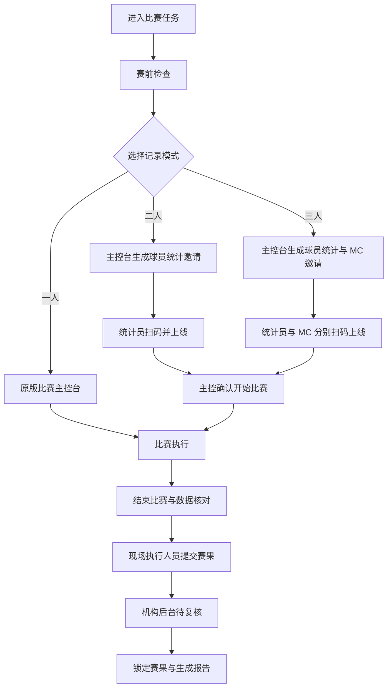
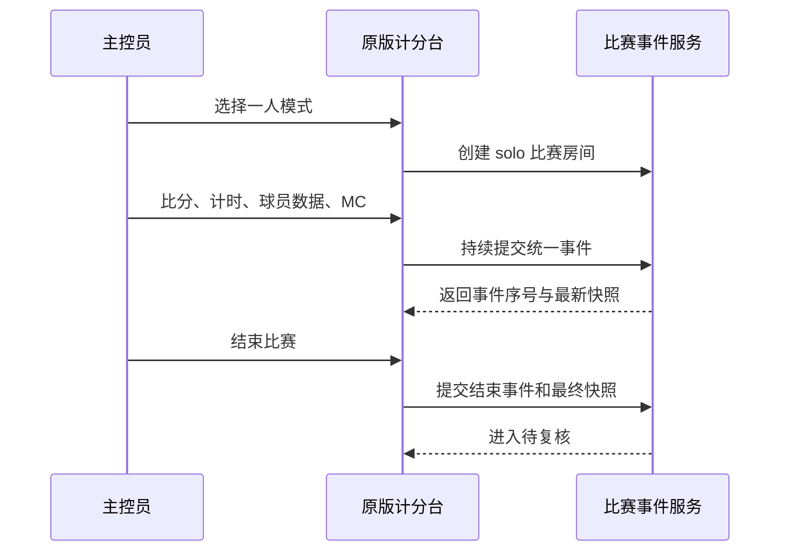
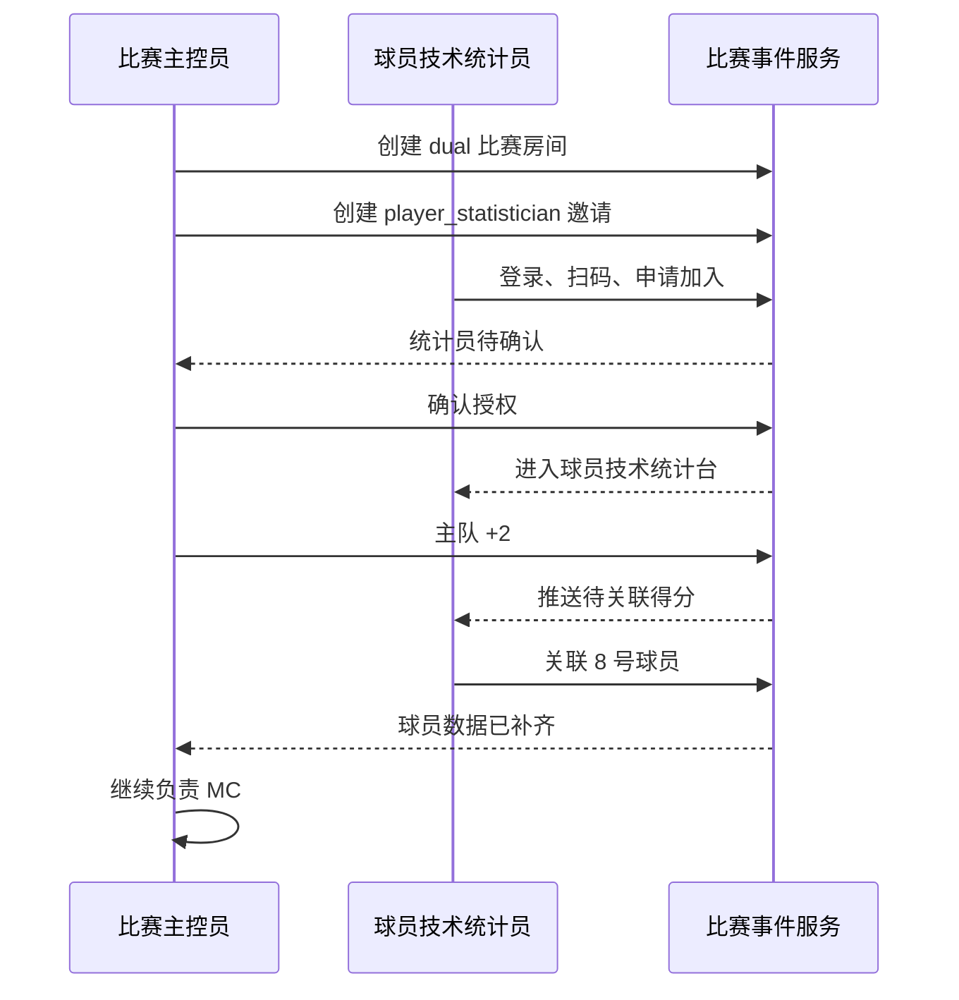
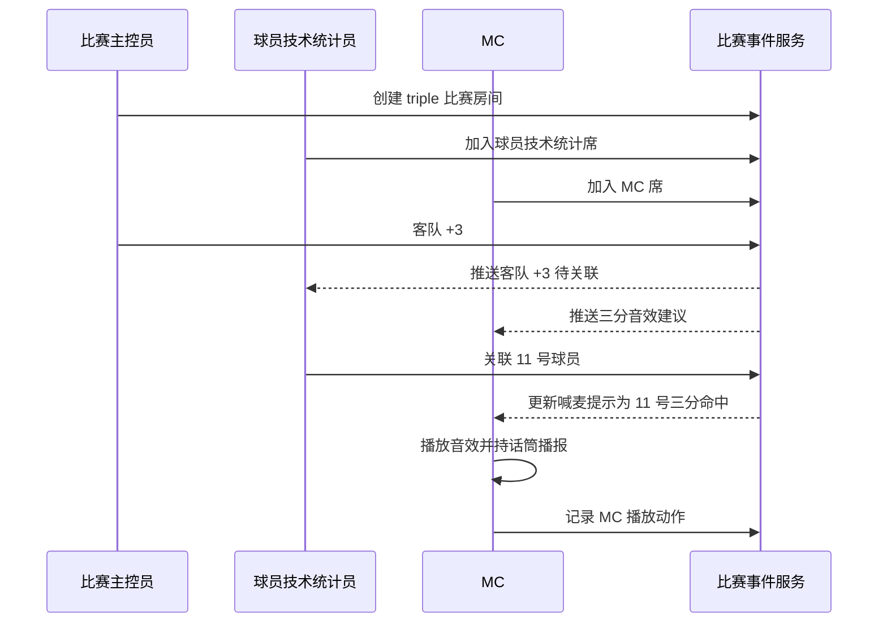
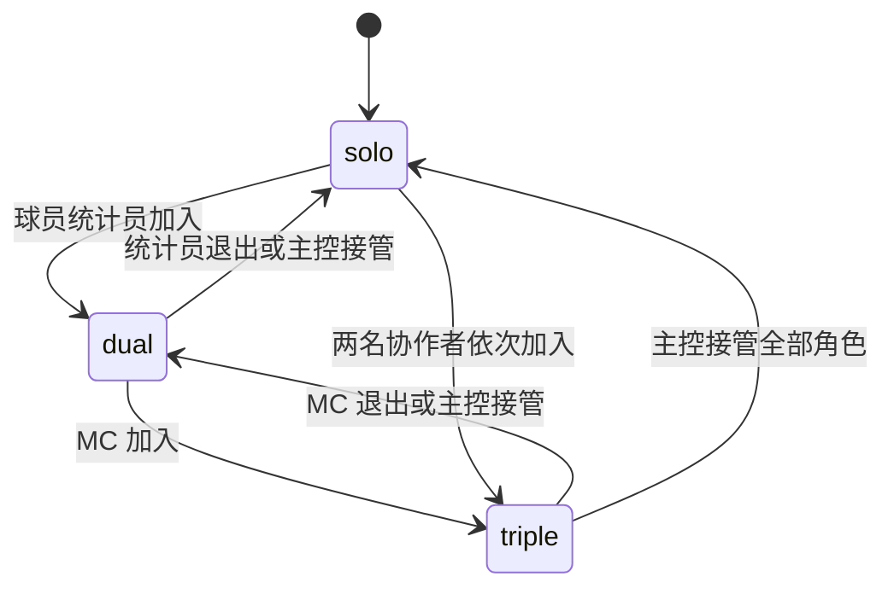
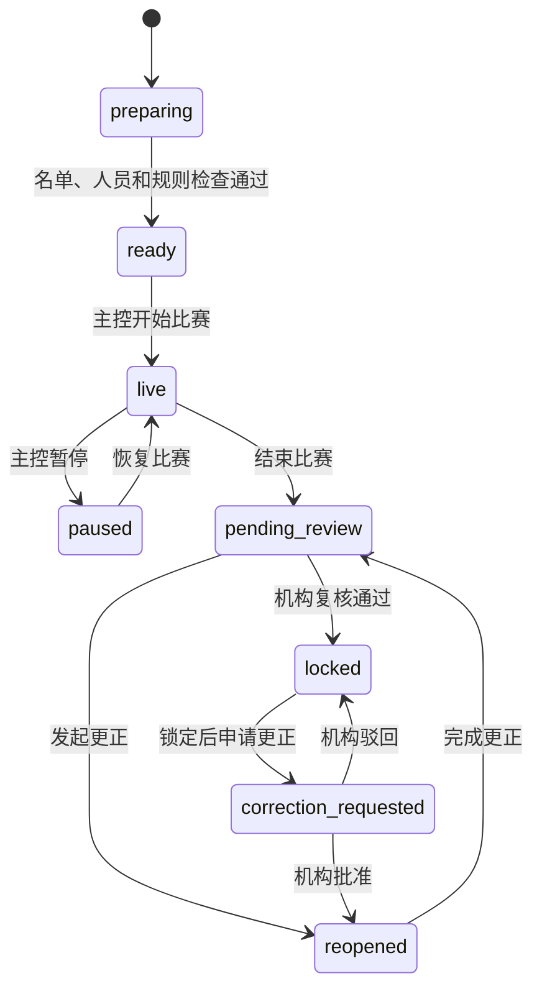

# 赛小蜂篮球三席协同控制台 M0 产品与数据冻结规格

> - 版本：M0 v1.0
> - 状态：已冻结，可进入 M1 技术实现
> - 日期：2026-07-27
> - 上位计划：`docs/THREE_CONSOLE_COLLABORATION_IMPLEMENTATION_PLAN.md`
> - 实现来源：`native-dist/`

---

## 一、M0 冻结结论

本文件冻结三席协同控制台进入开发前的产品和数据规则。后续 M1 至 M3 的实现不得绕过本文件中的权威写入端、事件关联和权限规则。

已经冻结的核心决策：

1. 一人模式保留原版完整控制界面。
2. 二人模式只拆出球员技术统计，主控继续负责比分、计时、24/14 秒和 MC。
3. 三人模式继续从主控拆出 MC。
4. 球队总比分只能由比赛主控台改变。
5. 球员统计台只给球队事件补充球员归属和技术统计，不能重复增加球队比分。
6. MC 现场台只能读取比赛事件并操作音频，不能修改比赛或球员数据。
7. 主控员拥有角色邀请、回收、接管、结束比赛和最终确认权限。
8. 所有关键操作写入统一比赛事件流，撤销和更正不直接删除历史。
9. 多人模式必须使用服务端权限校验、幂等键、递增事件序号和状态快照。
10. M1 先完成单人模式云端事件化，验收通过后才能进入二人模式。

---

## 二、角色与术语

### 2.1 业务角色

| 中文名称 | 系统标识 | 定义 |
|---|---|---|
| 比赛主控员 | `main_operator` | 负责球队比分、时钟、节次、球队级事件和比赛最终状态 |
| 球员技术统计员 | `player_statistician` | 负责球员归属、投篮、篮板、助攻等个人技术统计 |
| MC | `mc_operator` | 负责音乐、音效、话筒提示和现场氛围 |
| 机构赛事管理员 | `org_tournament_admin` | 赛训经营增长平台 PC 后台管理员；在赛事中心扩展中管理赛事、分配工作人员并复核赛果 |
| 内部赛事执行教练 | `coach` | 机构内已有教练；被赛事管理员分配后，进入相应现场控制席执行工作 |
| 外请赛事执行人员 | `external_match_worker` | 不进入机构教练库；通过服务号邀请、关注和绑定后，只对被指派比赛获得受限查看与现场执行权限 |

系统不建立独立“主裁判”身份、通用裁判库或裁判登录入口。比赛主控员是现场系统权限，不是额外人员身份。赛事工作人员有两条来源：机构管理员可从内部教练中直接分配；也可向外请人员发送服务号邀请，完成绑定后仅授予受邀场次的权限，不写入机构教练、课程、课消、薪酬或经营主数据。

### 2.2 控制台

| 控制台 | 当前页面基础 | 主要用途 |
|---|---|---|
| 比赛主控台 | `pages/scorer`、`pages/scorer-board` | 比分、计时、比赛状态和现场总控 |
| 球员技术统计台 | `pages/stats-scorer` | 球员投篮和个人技术统计 |
| MC 现场台 | `pages/mc-system` | 音频、喊麦提示和现场氛围 |

---

## 三、页面流转

### 3.1 总体流转



### 3.2 一人模式



一人模式的界面要求：

- 统一使用横屏计分台布局；手机和 PAD 仅按横屏宽度做响应式适配。
- 不要求用户在比分、球员统计和 MC 页面之间频繁跳转。
- 完整球员统计可以使用现有球员抽屉、弹层或局部面板，不在 M1 重做视觉结构。
- M1 的变化主要发生在数据写入和恢复层。

### 3.3 二人模式



二人模式的界面要求：

- 主控台保留原有横屏计分结构：比分、时钟、24/14 秒、犯规、暂停、换人和 MC。
- 主控台的主客队阵容展示、球员选择和球员技术统计入口，在二人模式下移出主控台；主控仅保留必要的队伍级比赛信息。
- 新建的球员技术统计台是唯一的阵容与球员数据工作界面：展示主客队名单、场上阵容、换人状态、个人犯规和全部球员技术统计入口。
- 技术统计台顶部固定只读显示主控实时同步的主客比分、比赛时间、节次、24/14 秒、比赛状态、网络和同步状态；这些数据由主控台写入，统计台不自行计时也不能修改。
- 主控每次写入比分、时钟或节次事件后，服务端更新统一快照并向统计台推送；统计台以事件序号顺序应用更新，出现缺口时先补齐再继续记录球员数据。
- 技术统计台不能出现结束比赛、比分修正和 MC 播放按钮。

### 3.4 三人模式



三人模式的界面要求：

- 主控台与二人模式一致：阵容和球员数据已在独立统计台处理；主控只处理队伍级比赛控制。
- 当 MC 席已由第三台设备成功加入并接管时，主控台最下方原 MC 区域整体锁定并置灰，固定提示“MC 已由其他设备接管”，所有常规 MC 按钮均不可点击。
- 主控台不再提供常规 MC 播放入口；“停止全部音频”和“接管 MC”仅作为需二次确认的应急动作，不放入置灰的常规 MC 区域。
- 第三台设备独立展示完整 MC 现场台，独占音效、音乐、喊麦提示和播放控制。
- MC 台只读订阅比赛事件，音频操作不改变比赛状态。
- 技术统计台与二人模式保持一致。

### 3.5 模式升级与降级



模式变化规则：

- 只能由当前主控员发起。
- 进行中的比赛无需暂停即可邀请协作者。
- 角色交接时，旧权限先失效，新权限再生效。
- 模式变化增加 `permissionVersion`。
- 旧设备使用旧权限版本提交的写操作必须被服务端拒绝。
- 模式变化不能清空比赛事件、比分、时钟或球员统计。

---

## 四、权限矩阵

### 4.1 操作权限

符号说明：

- `写`：可以直接操作。
- `读`：只读显示。
- `接管`：正常不可写，主控完成接管后可写。
- `—`：不显示且无权限。

| 操作 | 一人主控 | 二人主控 | 二人统计员 | 三人主控 | 三人统计员 | 三人 MC |
|---|---|---|---|---|---|---|
| 查看比分、时钟、节次 | 写 | 写 | 读 | 写 | 读 | 读 |
| 球队 `+1/+2/+3` | 写 | 写 | — | 写 | — | — |
| 比分减分与修正 | 写 | 写 | — | 写 | — | — |
| 比赛时钟 | 写 | 写 | — | 写 | — | — |
| 24/14 秒 | 写 | 写 | 读 | 写 | 读 | 读 |
| 节次切换 | 写 | 写 | 读 | 写 | 读 | 读 |
| 球队犯规 | 写 | 写 | 读 | 写 | 读 | 读 |
| 球队暂停 | 写 | 写 | 读 | 写 | 读 | 读 |
| 换人和场上阵容 | 写 | 写 | 读 | 写 | 读 | 读 |
| 得分球员归属 | 写 | 接管 | 写 | 接管 | 写 | — |
| 投篮未中 | 写 | 接管 | 写 | 接管 | 写 | — |
| 篮板、助攻等个人统计 | 写 | 接管 | 写 | 接管 | 写 | — |
| 个人犯规归属 | 写 | 接管 | 写 | 接管 | 写 | — |
| 查看球员实时统计 | 写 | 读 | 写 | 读 | 写 | 读 |
| 播放 MC 音效 | 写 | 写 | — | 接管 | — | 写 |
| 调整 MC 音量 | 写 | 写 | — | 接管 | — | 写 |
| 话筒模式 | 写 | 写 | — | 接管 | — | 写 |
| 停止全部音频 | 写 | 写 | — | 写 | — | 写 |
| 撤销本人普通事件 | 写 | 写 | 写 | 写 | 写 | — |
| 撤销他人事件 | 写 | 写 | — | 写 | — | — |
| 邀请、移除协作者 | 写 | 写 | — | 写 | — | — |
| 接管统计或 MC | 写 | 写 | — | 写 | — | — |
| 结束比赛 | 写 | 写 | — | 写 | — | — |
| 最终赛果确认 | 写 | 写 | — | 写 | — | — |

### 4.2 权威写入端

| 数据 | 唯一权威写入端 | 其他控制台行为 |
|---|---|---|
| 球队总比分 | 比赛主控台 | 统计台只关联球员，MC 只读 |
| 比赛时钟 | 比赛主控台 | 其他控制台只读计算 |
| 24/14 秒 | 比赛主控台 | 其他控制台只读 |
| 节次 | 比赛主控台 | 其他控制台只读 |
| 球队犯规 | 比赛主控台 | 统计台关联球员 |
| 球员投篮与技术统计 | 球员技术统计台；一人模式由主控代行 | 主控在拆席后只读或接管 |
| MC 音频 | MC 现场台；一/二人模式由主控代行 | 统计台无权操作 |
| 比赛结束与锁定 | 比赛主控台 / 机构赛事管理员 | 其他控制台无权操作 |

### 4.3 主控接管

接管流程：

1. 主控选择“接管球员统计”或“接管 MC”。
2. 系统提示当前协作者和可能影响。
3. 主控确认。
4. 服务端提升 `permissionVersion`。
5. 原协作者立即变为只读并收到“权限已由主控接管”。
6. 主控台显示对应功能。
7. 记录接管原因、人员、设备和时间。

恢复分席时需要重新邀请或重新授权，不能自动恢复旧设备写权限。

---

## 五、比赛状态与角色状态

### 5.1 现场比赛状态

赛事筹备状态由机构后台管理；本节仅冻结现场执行状态。



状态标识：

- `preparing`：赛前设置和协作者加入。
- `ready`：可以开赛。
- `live`：比赛进行中。
- `paused`：比赛暂停，仍允许部分数据补录和 MC 操作。
- `pending_review`：比赛已结束，等待机构复核。
- `locked`：赛果已锁定。
- `correction_requested`：锁定后申请更正。
- `reopened`：仅允许授权人员更正。

### 5.2 协同房间状态

- `creating`
- `active`
- `degraded`：一个或多个协作者掉线，主控仍在线。
- `closing`
- `closed`

### 5.3 房间成员状态

- `invited`
- `joining`
- `online`
- `offline`
- `revoked`
- `left`

### 5.4 工作人员任务状态

- `unassigned`
- `pending_acceptance`
- `accepted`
- `checked_in`
- `working`
- `pending_confirmation`
- `completed`
- `declined`
- `reassigned`
- `absent`
- `cancelled`

---

## 六、事件通用结构

所有业务写入以事件为审计依据。逻辑结构冻结如下：

```json
{
  "eventId": "evt_xxx",
  "orgId": "org_xxx",
  "tournamentId": "tournament_xxx",
  "matchId": "match_xxx",
  "sessionId": "session_xxx",
  "sequence": 1024,
  "eventType": "score.awarded",
  "eventVersion": 1,
  "operatorId": "user_xxx",
  "operatorRole": "main_operator",
  "deviceId": "device_xxx",
  "permissionVersion": 3,
  "period": 2,
  "gameClockMs": 326000,
  "shotClockMs": 14000,
  "teamId": "team_home",
  "playerId": "",
  "correlationId": "correlation_xxx",
  "causationEventId": "",
  "idempotencyKey": "device_xxx:local_123",
  "payload": {},
  "clientTime": 1780000000000,
  "serverTime": 1780000000123,
  "status": "active"
}
```

字段规则：

- `sequence` 由服务端按房间递增分配。
- `eventId` 和 `idempotencyKey` 全局唯一。
- `orgId`、`operatorId` 和 `operatorRole` 由服务端会话与授权推导。
- `clientTime` 只用于现场辅助，审计排序以 `sequence` 和 `serverTime` 为准。
- `period`、`gameClockMs`、`shotClockMs` 保存事件发生时上下文。
- `causationEventId` 指向触发本事件的上游事件。
- `correlationId` 将一次业务动作的多个事件串联。
- `status` 首期使用 `active`、`voided`、`superseded`。

---

## 七、事件字典

### 7.1 房间与权限事件

| 事件类型 | 权威角色 | 必需载荷 | 说明 |
|---|---|---|---|
| `session.created` | 主控 | `mode` | 创建现场协同房间 |
| `session.mode_changed` | 主控 | `fromMode`、`toMode`、`reason` | 一人、二人、三人模式变化 |
| `session.invite_created` | 主控 | `targetRole`、`expiresAt` | 创建一次性角色邀请 |
| `session.member_joined` | 系统 | `userId`、`role`、`deviceId` | 协作者加入 |
| `session.member_offline` | 系统 | `userId`、`role` | 心跳超时 |
| `session.member_left` | 成员/系统 | `userId`、`role` | 主动退出或房间关闭 |
| `session.role_revoked` | 主控 | `targetUserId`、`role`、`reason` | 回收权限 |
| `session.role_taken_over` | 主控 | `role`、`previousUserId`、`reason` | 主控接管 |
| `session.closed` | 系统 | `reason` | 房间关闭 |

### 7.2 比赛生命周期事件

| 事件类型 | 权威角色 | 必需载荷 | 说明 |
|---|---|---|---|
| `match.ready` | 主控 | `checkResult` | 赛前检查完成 |
| `match.started` | 主控 | `startedAt` | 比赛正式开始 |
| `match.paused` | 主控 | `reason` | 比赛暂停 |
| `match.resumed` | 主控 | `reason` | 比赛恢复 |
| `match.ended` | 主控 | `reportMode` | 现场比赛结束，进入待复核 |
| `match.locked` | 机构管理员 | `reviewerId` | 赛果锁定 |
| `match.correction_requested` | 主控/机构管理员 | `reason` | 锁定后申请更正 |
| `match.reopened` | 机构管理员 | `reason` | 批准更正 |
| `match.correction_completed` | 主控/机构管理员 | `summary` | 更正完成并重新待复核 |

### 7.3 比分事件

| 事件类型 | 权威角色 | 必需载荷 | 对球员统计的影响 |
|---|---|---|---|
| `score.awarded` | 主控 | `teamId`、`points` | 有球员归属时自动形成一次命中；无归属时进入待处理 |
| `score.adjusted` | 主控 | `teamId`、`delta`、`reason` | 不自动形成投篮，默认记为待核对分差 |
| `score.attributed` | 统计员/一人主控 | `scoreEventId`、`playerId`、`shotType` | 给原得分事件关联球员并派生命中统计 |
| `score.marked_team_only` | 主控 | `scoreEventId`、`reason` | 明确无法关联球员的球队得分 |

冻结规则：

- `score.awarded.points` 只允许 `1`、`2`、`3`。
- 减分和人工修正使用 `score.adjusted`，不使用负数 `score.awarded`。
- `score.attributed.shotType` 必须与原得分值匹配：
  - 1 分对应 `free_throw`。
  - 2 分对应 `two_point`。
  - 3 分对应 `three_point`。
- 一个 `score.awarded` 只能有一个有效球员归属。
- 修改归属使用更正事件，不覆盖原记录。

### 7.4 时钟与节次事件

| 事件类型 | 权威角色 | 必需载荷 |
|---|---|---|
| `game_clock.started` | 主控 | `remainingMs`、`anchorServerTime` |
| `game_clock.paused` | 主控 | `remainingMs` |
| `game_clock.adjusted` | 主控 | `fromMs`、`toMs`、`reason` |
| `game_clock.reset` | 主控 | `toMs`、`reason` |
| `shot_clock.enabled` | 主控 | `enabled` |
| `shot_clock.started` | 主控 | `remainingMs`、`anchorServerTime` |
| `shot_clock.paused` | 主控 | `remainingMs` |
| `shot_clock.reset` | 主控 | `toMs`、`reason` |
| `shot_clock.adjusted` | 主控 | `fromMs`、`toMs`、`reason` |
| `period.changed` | 主控 | `fromPeriod`、`toPeriod`、`reason` |
| `period.ended` | 主控/系统 | `period` |

冻结规则：

- 24 秒复位使用 `shot_clock.reset.toMs = 24000`。
- 14 秒复位使用 `shot_clock.reset.toMs = 14000`。
- 时钟运行期间不逐秒写事件。
- 显示值由剩余时间和服务端锚点本地计算。
- 同一时钟同一时间只有一个有效控制权租约。

### 7.5 球队事件

| 事件类型 | 权威角色 | 必需载荷 |
|---|---|---|
| `team_foul.recorded` | 主控 | `teamId`、`countsTowardTeamFoul` |
| `team_foul.attributed` | 统计员/一人主控 | `foulEventId`、`playerId`、`foulType` |
| `timeout.recorded` | 主控 | `teamId`、`durationMs`、`gameClockContinues` |
| `substitution.recorded` | 主控 | `teamId`、`playerOutId`、`playerInId` |
| `possession.changed` | 主控 | `teamId` |
| `court_sides.swapped` | 主控 | `displayLeftTeamId`、`displayRightTeamId` |

冻结规则：

- 交换场地只改变显示映射，不交换真实 `teamId`。
- 换人事件用于计算球员上场时间。
- 球队犯规先由主控记录，再由统计员关联具体球员。

### 7.6 球员技术统计事件

| 事件类型 | 权威角色 | 必需载荷 | 派生统计 |
|---|---|---|---|
| `shot.missed` | 统计员/一人主控 | `teamId`、`playerId`、`shotType` | `2PA/3PA/FTA +1` |
| `rebound.recorded` | 统计员/一人主控 | `playerId`、`reboundType` | `OREB` 或 `DREB +1` |
| `assist.recorded` | 统计员/一人主控 | `playerId`、可选 `scoreEventId` | `AST +1` |
| `steal.recorded` | 统计员/一人主控 | `playerId` | `STL +1` |
| `block.recorded` | 统计员/一人主控 | `playerId` | `BLK +1` |
| `turnover.recorded` | 统计员/一人主控 | `playerId` | `TOV +1` |
| `player_foul.recorded` | 统计员/一人主控 | `playerId`、`foulType` | 无球队犯规来源时进入待核对 |
| `lineup.player_entered` | 主控 | `playerId` | 开始计算上场时间 |
| `lineup.player_left` | 主控 | `playerId` | 结束本段上场时间 |

投篮类型：

- `free_throw`
- `two_point`
- `three_point`

篮板类型：

- `offensive`
- `defensive`

犯规类型首期：

- `personal`
- `technical`
- `unsportsmanlike`

任何计入球队犯规的球员犯规，都必须先有 `team_foul.recorded`，再通过 `team_foul.attributed` 关联球员。`player_foul.recorded` 只用于不计入球队犯规的特殊记录或经过主控确认的补录，并必须明确 `countsTowardTeamFoul = false`。

### 7.7 MC 事件

| 事件类型 | 权威角色 | 必需载荷 | 是否影响比赛数据 |
|---|---|---|---|
| `mc.audio_played` | MC/兼任主控 | `audioId`、`channel`、`source` | 否 |
| `mc.audio_paused` | MC/兼任主控 | `audioId`、`positionMs` | 否 |
| `mc.audio_stopped` | MC/主控 | `audioId`、`reason` | 否 |
| `mc.all_audio_stopped` | MC/主控 | `reason` | 否 |
| `mc.volume_changed` | MC/兼任主控 | `channel`、`from`、`to` | 否 |
| `mc.mic_mode_changed` | MC/兼任主控 | `enabled` | 否 |
| `mc.recommendation_acknowledged` | MC/兼任主控 | `recommendationId`、`decision` | 否 |

`source` 使用：

- `manual`
- `recommended`
- `automatic`

首期默认 `manual` 或 `recommended`，自动播放必须显式开启。

### 7.8 撤销与更正事件

| 事件类型 | 权威角色 | 必需载荷 | 说明 |
|---|---|---|---|
| `event.voided` | 原操作人/主控 | `targetEventId`、`reason` | 撤销目标事件 |
| `event.corrected` | 主控/授权统计员 | `targetEventId`、`replacement`、`reason` | 使用新内容替代 |
| `event.correction_rejected` | 主控/机构管理员 | `targetEventId`、`reason` | 拒绝更正申请 |

规则：

- 原始事件永久保留。
- 被撤销事件不再参与快照和统计计算。
- 被更正事件标记为 `superseded`，替代事件参与计算。
- MC 已经播放的声音不能使用“撤销”改变历史；需要停止时追加 `mc.audio_stopped` 或 `mc.all_audio_stopped`。
- 统计员只能撤销本人未锁定的统计事件。
- 主控可以在比赛未锁定时撤销比赛和统计事件。

---

## 八、球员统计派生规则

### 8.1 命中统计

`score.awarded + score.attributed` 派生：

| 得分 | `shotType` | 派生 |
|---:|---|---|
| 1 | `free_throw` | `FTM +1`、`FTA +1`、`PTS +1` |
| 2 | `two_point` | `2PM +1`、`2PA +1`、`PTS +2` |
| 3 | `three_point` | `3PM +1`、`3PA +1`、`PTS +3` |

`shot.missed` 派生：

| `shotType` | 派生 |
|---|---|
| `free_throw` | `FTA +1` |
| `two_point` | `2PA +1` |
| `three_point` | `3PA +1` |

### 8.2 汇总公式

```text
FGM = 2PM + 3PM
FGA = 2PA + 3PA
FG% = FGM / FGA
2P% = 2PM / 2PA
3P% = 3PM / 3PA
FT% = FTM / FTA
REB = OREB + DREB
PTS = 2PM × 2 + 3PM × 3 + FTM
```

分母为 0 时显示 `—`。

### 8.3 一致性检查

实时检查项：

- `球队总比分 = 已归属球员得分 + 已确认球队得分 + 待关联得分`
- 已归属球员得分必须满足投篮派生公式。
- 球员命中数不能大于出手数。
- 球员在场时间不能为负数。
- 同一球员不能同时出现在场上和替补状态。
- 已犯满球员继续上场时必须提示主控。

赛后必须处理：

- 待关联得分。
- 待关联球队犯规。
- 同步失败事件。
- 被更正但尚未重新计算的统计。
- 球队比分与球员得分差额。

---

## 九、核心数据结构

### 9.1 `matchSessions`

```json
{
  "_id": "session_xxx",
  "orgId": "org_xxx",
  "tournamentId": "tournament_xxx",
  "matchId": "match_xxx",
  "mode": "solo",
  "status": "active",
  "matchStatus": "live",
  "mainOperatorId": "user_xxx",
  "permissionVersion": 1,
  "lastSequence": 1024,
  "snapshotVersion": 1024,
  "activeGameClockLease": {},
  "activeShotClockLease": {},
  "startedAt": 1780000000000,
  "endedAt": 0,
  "lockedAt": 0,
  "createdAt": 1780000000000,
  "updatedAt": 1780000000000
}
```

约束：

- 同一 `matchId` 同一时间最多一个未关闭房间。
- `mode` 只允许 `solo`、`dual`、`triple`。
- `lastSequence` 只能由服务端事务递增。

### 9.2 `matchSessionMembers`

```json
{
  "_id": "member_xxx",
  "orgId": "org_xxx",
  "sessionId": "session_xxx",
  "matchId": "match_xxx",
  "userId": "user_xxx",
  "role": "player_statistician",
  "status": "online",
  "deviceId": "device_xxx",
  "assignmentId": "assignment_xxx",
  "permissionVersion": 3,
  "joinedAt": 1780000000000,
  "lastSeenAt": 1780000000000,
  "revokedAt": 0,
  "leftAt": 0
}
```

约束：

- 同一房间每个写角色同一时间最多一个 `online` 成员。
- 用户可拥有业务上的多个角色，但同一设备只能以一个当前控制席写入。
- 被 `revoked` 的成员不能恢复为 `online`，必须重新授权。

### 9.3 `matchStaffAssignments`

机构赛事管理员在 PC 后台把某场比赛的具体工作分配给内部教练，或向外请人员发送服务号邀请。内部教练不需要额外注册裁判身份；外请人员不进入机构教练库。

```json
{
  "_id": "assignment_xxx",
  "orgId": "org_xxx",
  "tournamentId": "tournament_xxx",
  "matchId": "match_xxx",
  "workerSource": "internal_coach",
  "coachId": "coach_xxx",
  "externalWorkerId": "",
  "duty": "player_statistician",
  "status": "accepted",
  "assignedBy": "org_admin_xxx",
  "assignedAt": 1780000000000,
  "acceptedAt": 1780000000000,
  "confirmedAt": 0,
  "reassignedFrom": "",
  "note": ""
}
```

`workerSource` 只允许 `internal_coach`、`external_referee`。当来源为 `internal_coach` 时必须填写 `coachId`；当来源为 `external_referee` 时必须填写 `externalWorkerId`；两者不可同时有效。`duty` 只允许 `main_operator`、`player_statistician`、`mc_operator`。一名工作人员可以在人员不足时被分配多个工作，但同一场比赛中每个拆分席位同一时间只有一名有效执行人。

### 9.4 `externalMatchWorkerBindings`

外请人员通过服务号关注并完成邀请绑定后生成轻量执行身份。该集合不是机构教练库，也不承载课程、课消、薪酬或经营资料。

```json
{
  "_id": "external_worker_xxx",
  "orgId": "org_xxx",
  "officialAccountUserId": "oa_user_xxx",
  "identityType": "external_referee",
  "displayName": "张三",
  "status": "bound",
  "boundByInviteId": "external_invite_xxx",
  "boundAt": 1780000000000,
  "lastActiveAt": 1780000000000,
  "revokedAt": 0
}
```

绑定只解决外请人员的服务号身份与受邀机构之间的对应关系；是否可以查看或操作某场比赛，仍以有效的 `matchStaffAssignments` 为准。

### 9.5 `matchRoleInvites`

```json
{
  "_id": "invite_xxx",
  "orgId": "org_xxx",
  "sessionId": "session_xxx",
  "matchId": "match_xxx",
  "targetRole": "mc_operator",
  "tokenHash": "hash_xxx",
  "status": "active",
  "createdBy": "user_xxx",
  "expiresAt": 1780000300000,
  "usedBy": "",
  "usedAt": 0,
  "createdAt": 1780000000000
}
```

只保存邀请凭证哈希，不保存可直接使用的明文凭证。

### 9.5 `matchEvents`

使用第六章通用结构。`payload` 只保存事件特有字段，禁止重复保存整场比赛快照。

### 9.6 `matchSnapshots`

```json
{
  "_id": "snapshot_xxx",
  "orgId": "org_xxx",
  "sessionId": "session_xxx",
  "matchId": "match_xxx",
  "appliedSequence": 1024,
  "matchStatus": "live",
  "period": 2,
  "homeTeamId": "team_home",
  "awayTeamId": "team_away",
  "homeScore": 42,
  "awayScore": 38,
  "homeFouls": 3,
  "awayFouls": 4,
  "homeTimeouts": 1,
  "awayTimeouts": 0,
  "gameClock": {
    "remainingMs": 326000,
    "running": true,
    "anchorServerTime": 1780000000000
  },
  "shotClock": {
    "enabled": true,
    "remainingMs": 14000,
    "running": true,
    "anchorServerTime": 1780000000000
  },
  "displaySides": {
    "leftTeamId": "team_home",
    "rightTeamId": "team_away"
  },
  "pendingScoreAttributions": [],
  "pendingFoulAttributions": [],
  "updatedAt": 1780000000000
}
```

### 9.7 `playerStatSnapshots`

每名球员每场一条快照：

```json
{
  "_id": "stat_xxx",
  "orgId": "org_xxx",
  "sessionId": "session_xxx",
  "matchId": "match_xxx",
  "teamId": "team_home",
  "playerId": "player_8",
  "appliedSequence": 1024,
  "points": 10,
  "twoMade": 3,
  "twoAttempted": 4,
  "threeMade": 1,
  "threeAttempted": 3,
  "freeThrowMade": 1,
  "freeThrowAttempted": 2,
  "offensiveRebounds": 2,
  "defensiveRebounds": 3,
  "assists": 3,
  "steals": 2,
  "blocks": 1,
  "turnovers": 1,
  "personalFouls": 2,
  "technicalFouls": 0,
  "unsportsmanlikeFouls": 0,
  "playingTimeMs": 960000,
  "onCourt": true,
  "updatedAt": 1780000000000
}
```

命中率不必持久化，读取时按命中和出手计算，避免百分比失真。

### 9.8 `devicePresence`

```json
{
  "_id": "presence_xxx",
  "orgId": "org_xxx",
  "sessionId": "session_xxx",
  "userId": "user_xxx",
  "role": "mc_operator",
  "deviceId": "device_xxx",
  "status": "online",
  "appVersion": "x.x.x",
  "networkType": "wifi",
  "lastSeenAt": 1780000000000
}
```

在线状态是临时运行数据，不作为永久审计记录。

---

## 十、索引与数据隔离

### 10.1 必需索引

| 集合 | 索引 |
|---|---|
| `matchSessions` | `orgId + matchId + status` |
| `matchSessionMembers` | `sessionId + role + status` |
| `matchSessionMembers` | `sessionId + userId + deviceId` |
| `matchStaffAssignments` | `orgId + matchId + duty + status` |
| `matchStaffAssignments` | `orgId + coachId + status` |
| `matchStaffAssignments` | `orgId + externalWorkerId + status` |
| `externalMatchWorkerBindings` | 唯一：`orgId + officialAccountUserId` |
| `externalMatchWorkerBindings` | `orgId + status` |
| `matchRoleInvites` | `sessionId + targetRole + status + expiresAt` |
| `matchEvents` | 唯一：`sessionId + sequence` |
| `matchEvents` | 唯一：`sessionId + idempotencyKey` |
| `matchEvents` | `orgId + matchId + serverTime` |
| `matchSnapshots` | 唯一：`sessionId` |
| `playerStatSnapshots` | 唯一：`sessionId + playerId` |
| `devicePresence` | 唯一：`sessionId + deviceId` |

### 10.2 安全规则

- 关键写入只通过云函数或受控服务完成，不允许客户端直接写 `matchEvents`。
- 服务端从登录态取得用户身份。
- 服务端从用户机构成员关系取得 `orgId`。
- 每次写入校验比赛、房间、角色、设备和 `permissionVersion`。
- 外请人员只能读取其有效 `matchStaffAssignments` 对应场次的任务、赛程、对阵、规则、现场数据和赛后结果；不得读取机构教练、学员、课程、课消、薪酬或经营数据。
- 外请人员仅能在任务已接受、比赛房间有效且席位权限未被回收时，写入该场次被授予控制席允许的事件。
- 平台管理员跨机构查看必须走独立平台权限并写入审计日志。
- 邀请凭证、后台口令和敏感联系方式不得进入普通日志。

---

## 十一、逻辑接口冻结

M0 冻结逻辑接口，不冻结最终云函数文件名。

| 命令 | 调用者 | 结果 |
|---|---|---|
| `createMatchSession` | 主控 | 创建一人模式房间 |
| `getMatchSession` | 房间成员 | 返回权限、快照和增量游标 |
| `changeSessionMode` | 主控 | 切换一人、二人、三人模式 |
| `assignInternalMatchWorker` | 机构赛事管理员 | 向内部教练分配场次与控制席 |
| `createExternalMatchWorkerInvite` | 机构赛事管理员 | 创建外请人员服务号邀请 |
| `bindExternalMatchWorkerInvite` | 服务号已关注用户 | 绑定轻量执行身份并关联受邀任务 |
| `getExternalMatchTaskView` | 已绑定外请人员 | 返回本人获授权场次的数据与小程序任务入口 |
| `createRoleInvite` | 主控 | 创建统计或 MC 邀请 |
| `joinRoleInvite` | 登录用户 | 申请加入指定角色 |
| `confirmSessionMember` | 主控 | 确认协作者 |
| `heartbeatSessionMember` | 房间成员 | 更新在线状态 |
| `revokeSessionMember` | 主控 | 回收协作者权限 |
| `takeOverSessionRole` | 主控 | 接管统计或 MC |
| `submitMatchEvent` | 有权成员 | 幂等提交一个事件 |
| `submitMatchEventBatch` | 有权成员 | 断网恢复时批量提交 |
| `syncMatchEvents` | 房间成员 | 从指定序号拉取增量 |
| `getMatchSnapshot` | 房间成员 | 获取最新比赛和统计快照 |
| `endMatchSession` | 主控 | 结束比赛并进入待复核 |
| `requestMatchCorrection` | 主控/机构管理员 | 发起更正 |
| `lockMatchResult` | 机构管理员 | 锁定赛果 |

每个写命令都必须接收 `idempotencyKey`，返回：

- `accepted`
- `eventId`
- `sequence`
- `permissionVersion`
- `snapshotVersion`
- 可选 `rejectionCode`

---

## 十二、同步与失败处理

### 12.1 客户端状态

每个控制台固定显示：

- `已同步`
- `正在同步`
- `弱网`
- `离线记录`
- `同步冲突`
- `权限已变更`

不能只在控制台日志中记录同步失败。

### 12.2 增量同步

1. 客户端保存最后已应用 `sequence`。
2. 实时订阅收到新事件时按序应用。
3. 发现序号缺口时暂停应用后续事件。
4. 调用 `syncMatchEvents` 补齐缺失区间。
5. 事件补齐后恢复实时订阅。
6. 序号差距过大或快照版本不兼容时重新获取快照。

### 12.3 本地队列

本地待提交事件至少保存：

- 本地事件 ID。
- 幂等键。
- 命令类型和载荷。
- 创建时间。
- 当时权限版本。
- 重试次数。
- 最后错误。

权限已被回收的离线事件不能自动写入，必须进入人工核对。

### 12.4 失败代码

首期必须区分：

- `NOT_AUTHENTICATED`
- `ORG_FORBIDDEN`
- `SESSION_NOT_FOUND`
- `SESSION_CLOSED`
- `ROLE_FORBIDDEN`
- `PERMISSION_VERSION_STALE`
- `DEVICE_REVOKED`
- `EVENT_DUPLICATE`
- `SEQUENCE_CONFLICT`
- `EVENT_INVALID`
- `MATCH_ALREADY_ENDED`
- `MATCH_RESULT_LOCKED`

---

## 十三、现有实现复用清单

### 13.1 比赛主控台

现有可复用：

- 主客队比分和 `+1/+2/+3`。
- 比赛正计时、倒计时。
- 24/14 秒。
- 节次、休息和暂停倒计时。
- 球队犯规和暂停。
- 阵容、换人和交换场地。
- 球员基础统计。
- MC 音频。
- 撤销栈。
- 本地比赛恢复。
- 结束比赛和现有赛后报告（当前页面路径仍为 `referee-report`）。

需要改造：

- `Date.now()` 事件 ID 改为稳定唯一 ID。
- 本地快照撤销改为事件撤销。
- 得分减分改为 `score.adjusted`。
- 球队真实 ID 与左右显示位置分离。
- 本地保存改为本地缓存 + 云端事件。
- 计时器改为服务端锚点和控制权租约。
- 球员统计从累加字段改为事件派生。

### 13.2 球员技术统计台

当前页面仅为预览，正式实现需要：

- 比赛房间加入和权限状态。
- 双方球员和场上阵容。
- 快速记录、球员数据、待处理三个页签。
- 投篮命中/未中及命中率。
- 得分、犯规待关联。
- 其他个人技术统计。
- 本人撤销和同步失败队列。

### 13.3 MC 现场台

现有可复用：

- 云存储音频 URL 解析。
- 单路音频不叠加。
- 已有比赛音效和攻防音乐。

正式实现需要：

- 比赛房间加入和角色权限。
- 比赛事件订阅。
- 当前播放、音量、暂停、淡出和一键停止。
- 话筒模式。
- 音效预缓存。
- 动态喊麦提示。
- 推荐音效确认。
- 主控接管和设备掉线提示。

---

## 十四、单人模式回归清单

M1 必须保证以下现有能力不回退。

### 14.1 赛前设置

- 快捷比赛进入。
- 赛事场次进入。
- 主客队名称和队标。
- 球员名单和号码。
- 首发与替补。
- 节数、每节时长。
- 正计时与倒计时。
- 节间休息、中场休息和暂停时间。
- 24 秒开关。

### 14.2 比赛控制

- 主客队 `+1/+2/+3`。
- 比分不能低于 0。
- 比分修正。
- 比赛时钟开始、暂停和恢复。
- 24/14 秒启动、暂停和复位。
- 节次切换。
- 节末提示和休息倒计时。
- 球队暂停。
- 球队犯规。
- 球权切换。
- 交换场地不改变真实球队数据归属。

### 14.3 球员与统计

- 选择得分球员。
- 球员得分累计。
- 篮板、助攻、抢断、盖帽、失误和犯规。
- 首发、替补和换人。
- 球员号码搜索。
- 阵容抽屉。

### 14.4 MC

- 两分、三分和蜂鸣器。
- 进攻、防守和暂停音乐。
- 自定义音效。
- 当前播放停止。
- 音频库刷新。
- 音频缓存与设置。

### 14.5 操作安全

- 撤销上一操作。
- 重置比赛二次确认。
- 结束比赛二次确认。
- 比赛结束后不能继续写关键事件。
- 页面退后台后时钟正确恢复。
- 网络重试不重复加分。

### 14.6 保存与报告

- 未结束比赛自动保存。
- 退出后恢复比赛。
- 最近比赛列表。
- 结束后保存最终比分。
- 不生成报告。
- 立即进入赛后赛事报告。
- 稍后补交赛后赛事报告。
- 云端保存赛果失败不丢本地记录。

### 14.7 横屏视口

- 手机横屏。
- 常见 Android 手机横屏。
- PAD 横屏。
- 横屏状态下的微信胶囊安全区。
- 大比分、长队名和长球员名。

---

## 十五、M0 首个试点规则

首个技术试点使用机构内部 5V5 单场比赛，不在 M1 同时验证复杂赛制。

默认规则：

- 4 节。
- 每节 10 分钟倒计时。
- 启用 24/14 秒。
- 个人犯规 5 次预警。
- 记录球队犯规。
- 支持球队暂停。
- 双方各 5 名首发，可配置替补。
- 同时验证一人、二人、三人模式。
- 比赛结束生成赛后赛事报告。

复杂赛事编排在 M5 单独验收，不能阻塞 M1 至 M3 的三席协同底座。

---

## 十六、M0 验收结论

| 验收项 | 结果 |
|---|---|
| 一人、二人、三人职责无重叠 | 通过 |
| 每类数据有唯一权威写入端 | 通过 |
| 得分与球员归属不重复计分 | 通过 |
| 命中、未中和命中率规则明确 | 通过 |
| 犯规归属和球队犯规关系明确 | 通过 |
| 撤销、更正和锁定规则明确 | 通过 |
| 模式升级、降级和角色接管明确 | 通过 |
| 事件通用结构和事件字典完成 | 通过 |
| 数据集合、索引和安全规则完成 | 通过 |
| 单人模式回归清单完成 | 通过 |
| 首个试点规则确定 | 通过 |

M0 状态：**完成**。

下一阶段：**M1 云端比赛房间与一人模式兼容**。

M1 开始前必须：

1. 建立独立 `codex/` 开发分支或工作树。
2. 关联 GitHub Issue。
3. 将本文件中的事件和数据结构转为技术接口与数据库迁移方案。
4. 先实现单人模式事件化，不提前开发二人或三人 UI。
