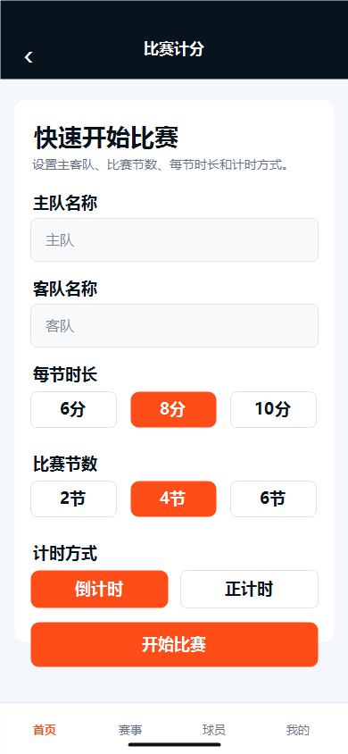
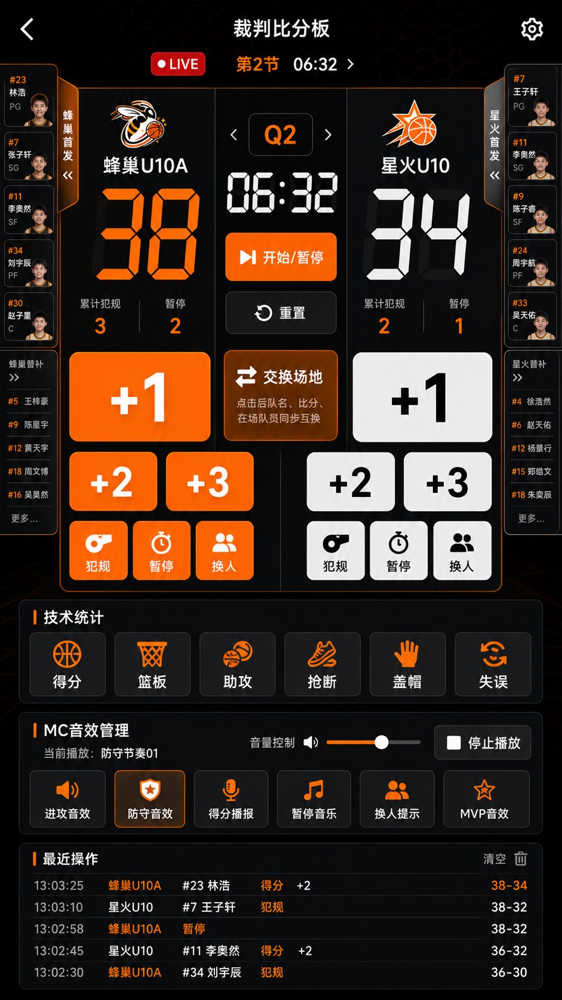
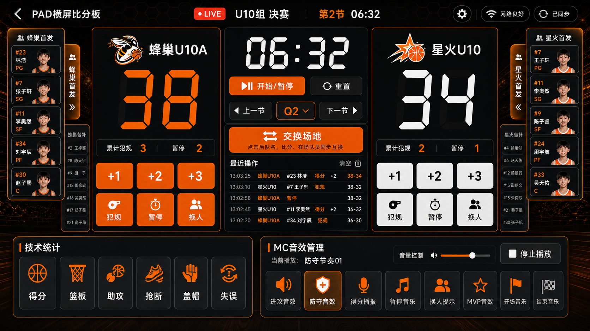
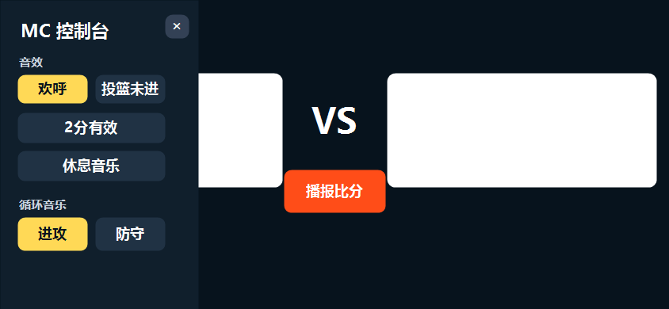
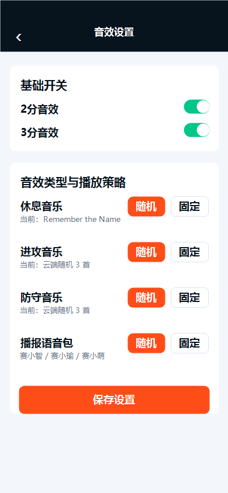
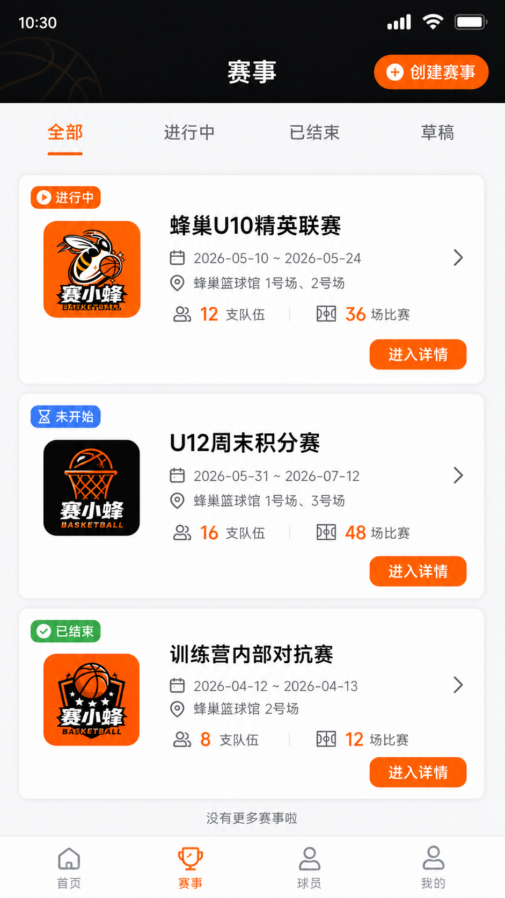
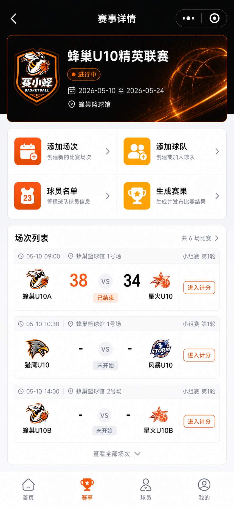
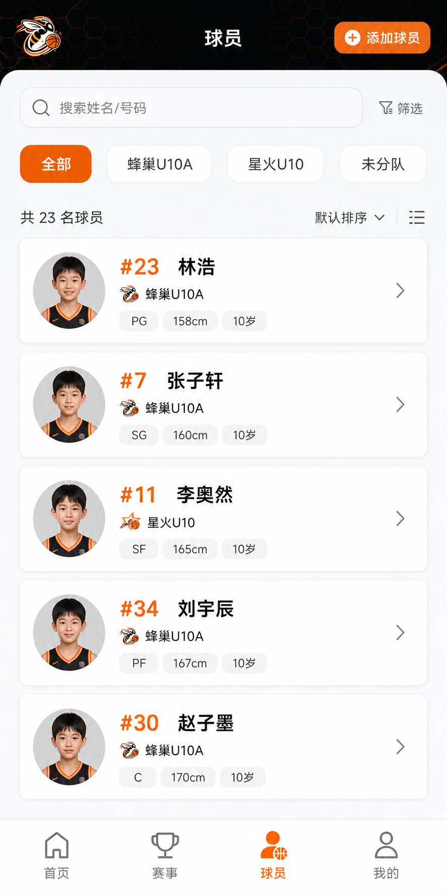
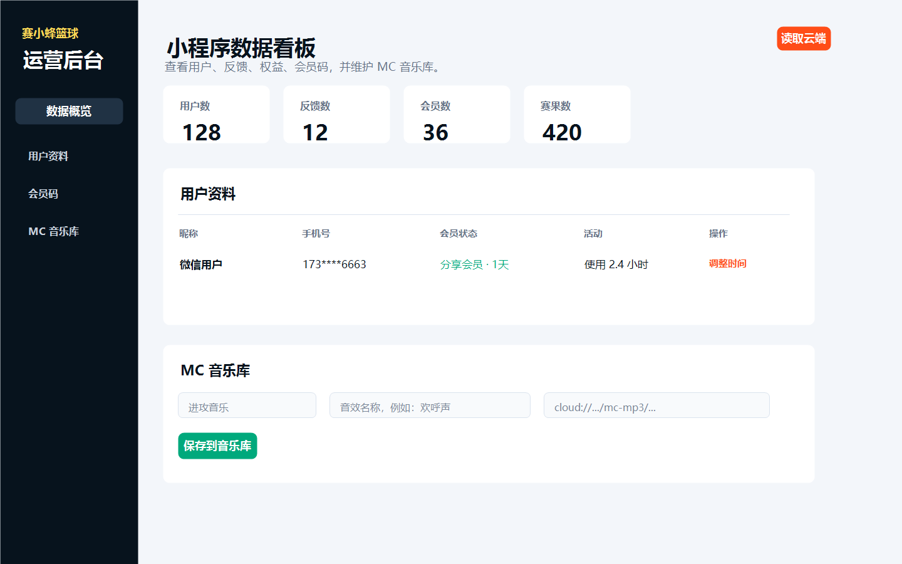
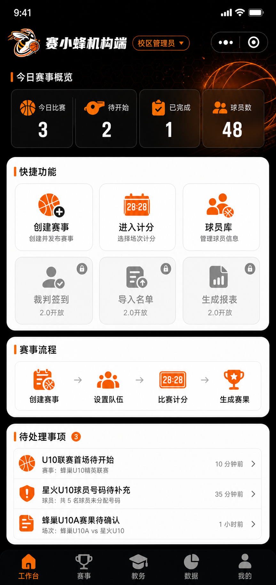

# 赛小蜂篮球 1.0 版本范围与原型交付说明

> 面向对象：开发、产品、UI。  
> 目标：从已完成的全局原型中筛选出 1.0 本期应实现的页面，并把 2.0/后期功能单独归档，避免开发范围失控。

## 一、1.0 版本定位

1.0 不是完整教培 SaaS，而是“篮球赛事计分 + MC现场音效 + 基础赛事/球员管理 + PC音频后台”的可演示、可交付版本。

### 1.0 必须体现
- 登录与游客体验
- 首页快速开赛
- 快速比赛设置
- 手机竖屏计分盘
- PAD横屏计分盘（建议作为增强项）
- MC音效播放与设置
- 赛事列表与场次进入计分
- 基础球员库
- 我的页面
- PC后台音乐库/会员管理

### 1.0 暂不展开
- 完整教务课消
- 薪酬销售核算
- 自动资格校验
- 首发报告/裁判报告/PDF专业报表
- 家长端球员卡/徽章/数据海报
- 多角色权限体系
- 教练游戏化成长体系

## 二、1.0 页面与原型图
### 1. 登录页（1.0必做）

- 微信登录、游客体验、协议勾选、品牌露出。
- 实现重点：登录状态、游客态、协议勾选校验。

### 2. 首页（1.0必做）

- 快速开始比赛、最近赛果、创建赛事、球员库入口。
- 实现重点：首页只放高频入口，不承载复杂教务功能。

### 3. 快速比赛设置（1.0必做）

- 设置主客队、节数、每节时长、计时方式。
- 实现重点：生成一场本地/云端比赛配置，进入计分盘。

### 4. 竖屏裁判比分板最终版（1.0必做）

- 核心计分、计时、犯规、暂停、换人、技术统计、MC小按钮、左右球员抽屉、交换场地。
- 规则：加分按钮最大；MC按钮不能大于加分按钮；裁判签到不放本页。

### 5. PAD横屏比分板最终版（1.0建议做）

- 记录台/PAD横屏使用，三栏布局，左右首发/替补抽屉，中间交换场地，底部MC面板。
- 如果工期紧，可作为1.0增强项，但设计上应提前确认。

### 6. MC音效抽屉（1.0必做）

- 现场欢呼、进攻、防守、暂停、得分播报等音效入口。
- 实现重点：单路播放，进攻/防守互斥循环，当前播放高亮。

### 7. 我的页面（1.0必做）

- 账号信息、会员、反馈、音效设置入口。
- 实现重点：账号态、游客态、会员权益入口。

### 8. MC音效设置（1.0必做）

- 音效开关、随机/固定播放、语音包、外设快捷键配置。
- 实现重点：设置项保存后影响计分盘MC面板。

### 9. 赛事列表（1.0必做）

- 赛事列表、状态筛选、创建赛事入口。
- 实现重点：草稿、进行中、已结束三类状态。

### 10. 赛事详情/场次管理（1.0必做）

- 赛事信息、添加场次、添加球队、球员名单、进入计分。
- 实现重点：从场次进入计分盘，赛果回写到赛事详情。

### 11. 球员库（1.0必做）

- 添加球员、姓名号码、所属球队、编辑球员。
- 实现重点：1.0只做基础球员库，不做成长系统。

### 12. PC管理后台（1.0必做）

- 用户、会员码、权益、MC音乐库管理。
- 实现重点：后台维护音频，小程序读取音频库。

## 三、后期迭代页面池
### 家长端卖课/课程体系
后期作为家长端/招生端，不纳入1.0核心计分交付。
- `02-parent-courses.png`
- `03-course-detail.png`
- `04-trial-booking.png`
- `05-student-growth-file.png`

### 教务管理
2.0教培机构管理能力，涉及课消、薪酬、校区、数据中台。
- `06-org-workbench.png`
- `09-edu-admin.png`
- `10-data-center.png`
- `20-payroll.png`
- `21-student-detail-data-center.png`

### 赛事数据打通
2.0赛事执行闭环，涉及名单、资格校验、报表、裁判报告。
- `14-roster-import.png`
- `15-eligibility-check.png`
- `25-starting-lineup-report.png`
- `26-referee-postgame-report.png`
- `19-match-report.png`

### 家长传播资产
2.0传播能力，球员卡、徽章、数据海报。
- `11-parent-share-assets.png`
- `17-parent-match-data.png`

### 多角色/游客/教练游戏化
2.0角色体系，1.0暂不展开。
- `12-role-entry.png`
- `16-coach-record.png`
- `18-public-live-score.png`
- `22-coach-gamification.png`

## 四、开发优先级
- P0：登录、首页、快速比赛设置、手机计分盘、赛事列表、赛事详情、球员库。
- P1：MC音效抽屉、MC音效设置、我的页面、PC后台音乐库。
- P2：PAD横屏比分板、外设快捷键、会员权益展示。
- P3：2.0教务、报表、家长传播、角色体系。

## 五、实现原则
- 复杂视觉素材用图片，比分、队名、球员、计时、表格必须用真实组件渲染。
- 比分板页面不放裁判签到，裁判签到后期放到递交首发/赛前管理页面。
- 加分按钮是计分盘最大按钮，MC按钮必须小于加分按钮。
- 交换场地只交换UI左右显示，不改变真实球队ID和历史事件归属。
- 1.0先保证现场可用，2.0再做教务和赛事数据深度打通。
## 六、2026-07-05 修订：1.0 底部菜单与工作台范围

### 1.0 底部菜单固定为五项

1. 工作台
2. 赛事
3. 教务
4. 数据
5. 我的

这五个菜单在 1.0 版本中都要出现，目的是让产品结构从一开始就具备机构端框架感。但功能开放范围要严格控制，不能把 2.0 的教务和数据中台误做成已上线能力。

### 工作台：1.0 只做赛事板块

工作台参考“赛小蜂机构端”样式，但 1.0 只承载赛事相关能力：

- 今日赛事概览
- 创建赛事
- 进入计分
- 球员库
- 赛事流程
- 待处理事项

以下快捷功能在 1.0 工作台中可以展示，但必须置灰并标注“2.0开放”或“规划中”：

- 裁判签到
- 导入名单
- 生成报表
- 课后评价
- 课销统计
- 教务联动

### 教务：1.0 固定介绍页

教务菜单 1.0 不做真实业务功能，只做介绍页，说明后续会支持课程、学员、课消、教练薪酬等能力。

### 数据：1.0 固定介绍页

数据菜单 1.0 不做完整数据中台，只说明后续的数据沉淀方向。当前版本只体现基础比赛比分、最近赛果、基础球员信息。

### 对开发的要求

- `工作台 / 赛事 / 球员 / 教务 / 数据 / 我的` 六个 Tab 必须在 1.0 出现。
- 工作台页面不要展示真实课销金额、今日课程、薪酬等 2.0 数据。
- 未开放功能必须灰色化，并显示“规划中”或“2.0开放”。
- 教务和数据页面不接复杂接口，先做静态介绍页。
- 后续 2.0 再替换教务和数据介绍页为真实功能页。
